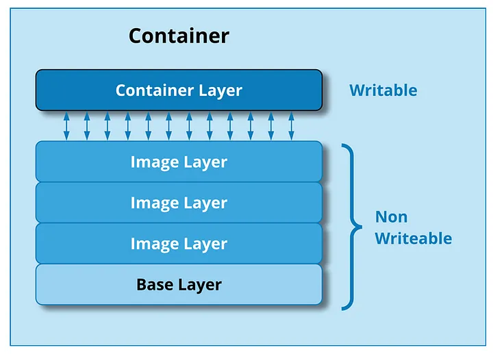

# Architecture de docker

Cette section détaille l'architecture de Docker, les composants principaux et les interactions entre eux. Cette compréhension est essentielle pour comprendre comment Docker fonctionne et en faire une utilisation courante.

## Composants clés

Docker repose sur plusieurs éléments fondamentaux qui travaillent ensemble pour fournir un environnement efficace et portable pour exécuter vos applications. Voici une présentation des principaux composants :

### :material-map-legend: Images Docker

Une *image Docker* est une unité autonome qui contient tout ce dont une application a besoin pour s'exécuter, y compris le code, les bibliothèques, les outils système, les variables d'environnement et les fichiers de configuration.

Imaginons que l'on veuille partager un projet (Python ou R par exemple) avec quelqu'un. Pour s'assurer que le projet fonctionne chez cette personne, il faudrait leur fournir :

* Le code source du projet
* La version de Python ou R à utiliser
* La liste des libraires à installer
* Les configurations système ou variables d'environnement nécssaires.

Avec Docker, toutes ces informations sont déjà inclues dans l'image. Vous n'avez pas à fournir ces inforamtions, car l'image contient :

* Le **système d'exploitation** nécessaire (du moins une version allégée)
* Les **outils et bibliothèques** utilisées par l'application
* Toutes les **dépendances** requises et déjà configurées

Quand vous partagez une image, elle garantit que tout fonctionnera exactement comme prévu, peu importe la machine ou l'environnement où elle est utilisée.

#### Structure des images Docker

Une image docker est composée de plusieurs couches d'instructions. Chacune représente une partie de l'application ou du système, par exemple : installer le système d'exploitation choisi, installer Python, installer pandas, etc.

Ces couches sont conçues pour être partagées et réutilisées. Cela signifie que si vous avez déjà une image avec les couches de base nécessaires, vous pouvez créer une nouvelle image en ajoutant simplement les couches supplémentaires spécifiques à votre application. Cela permet d'économiser de l'espace de stockage et d'accélérer le processus de création d'images.

### Conteneurs Docker

Un conteneur Docker est une instance exécutable d'une image Docker. Lorsqu'une image est exécutée, elle crée un conteneur. Les conteneurs sont isolés les uns des autres et du système hôte, ce qui garantit que chaque conteneur dispose de toutes les ressources nécessaires pour s'exécuter de manière indépendante. Les conteneurs peuvent être démarrés, arrêtés, redémarrés et supprimés à volonté, ce qui les rend idéaux pour les environnements de développement, de test et de production.

### Docker Daemon

Le Docker Daemon est un processus en cours d'exécution sur la machine hôte qui gère les images, les conteneurs, les réseaux et les volumes. Il est responsable de la construction, du démarrage et de l'arrêt des conteneurs, de la gestion des réseaux, de l'interaction avec les registres Docker et de la communication avec d'autres composants Docker, tels que le Docker CLI. Le Docker Daemon s'exécute en tant que service en arrière-plan sur la machine hôte et peut être contrôlé à distance à l'aide de l'interface de ligne de commande Docker (CLI).

### Docker CLI

Le Docker CLI est un outil en ligne de commande qui permet aux utilisateurs d'interagir avec le Docker Daemon. Il fournit une interface conviviale pour exécuter des commandes Docker, telles que la construction d'images, le démarrage et l'arrêt de conteneurs, la gestion des réseaux et la communication avec les registres Docker. Le Docker CLI est installé sur la machine hôte et peut être utilisé pour gérer les conteneurs Docker sur la machine locale ou à distance sur d'autres hôtes Docker.
