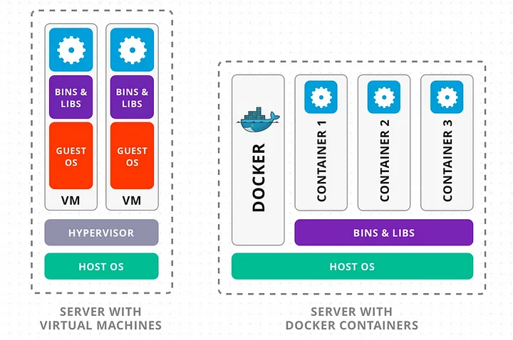

# Docker : introduction, historique et utilité

Docker est une plateforme ouverte qui automatis le déploiement des applications dans des conteneurs. Les conteneurs sont des environnements légers et portables qui contiennet tout ce dont une application a besoin pour fonctionner : code, librairies, dépendances, etc.

> En d'autres termes, Docker est un outil permettant de "construire une fois et exécuter partout".

Cela signifie que le comportement de l'application reste identique peu importe où elle est déployée :

* Sur la machine du développeur ;
* Dans un environnement de tests ;
* En production, sur des serveurs physiques ou dans le cloud.
  

## Historique : Docker et Machines Virtuelles

Avant l'arrivée de Docker, les entreprises s'appuyaient principalement sur des machines virtueles pour isoler les applications.
Une machine virtuelle contient tout un système d'exploitation complet, accompagné des applications et dépendances nécessaires, ce qui peut entraîner :
* Une consommation élevée de ressources (RAM, CPU, disque) car chaque VM embarque son propre OS
* Une faible portabilité et des difficultés d'intégration entre environnements
* Un démarrage plus lent à cause de la virtualisation complète (lenteur du démarrage de l'OS, etc.)

Docker, lancé en 2013, a révolutionné ce modèle en introduisant une *approche basée sur les conteneurs*, qui permettent :

* Une isolation similaire aux VM, mais un usage bien plus léger des ressources
* Une meilleure portabilité grâce à la standardisation des images Docker
* Un démarrage presque instantané des applications

## Pourquoi Docker ?

* :material-briefcase-outline: **Portabilité** : Une application dans un conteneur peut être déplacée d'un environnement à l'aure sans changement de comportement
* :material-wall: **Isolation** : Les applications fonctionnent dans des conteneurs séparés, ce qui évite les conflits de dépendances
* :material-feather: **Légèreté** : Contrairement aux VM, les conteneurs partagent le noyau de l'OS, réduisant l'encombrement pour démarrer une VM
* :material-clock-fast: **Rapidité** : Les conteneurs se lancent en quelques secondes, contrairement aux minutes nécessaires pour démarrer une VM
* :material-crane: **Flexibilité** : Docker permet de scaler facilement en créant ou supprimant des conteneurs dynamiquement.
  
